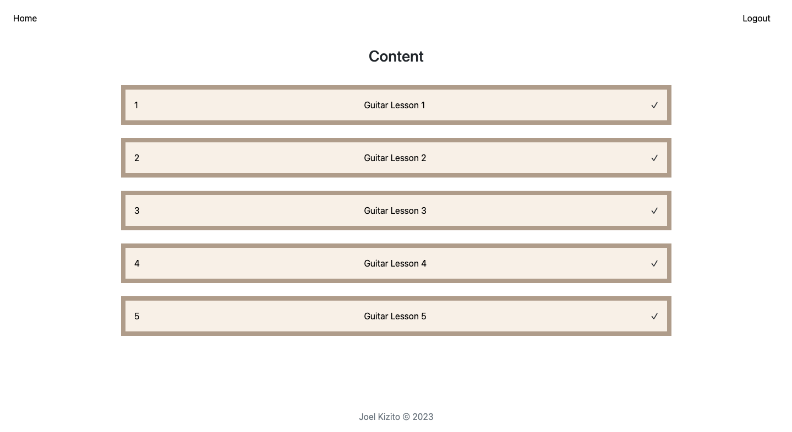

# Guitar Journal for The CS50 Project
#### Video Demo: https://youtu.be/l1iN0E1T5kE
#### Description: A self paced curriculum for aspiring guitarists

## Introduction
The guitar journal is a project meant to document my learning progress with the guitar while outlining a clear path to aspiring guitarists to becoming proficient with the guitar. The need to develop this project arises from the challenges I faced as I was learning the guitar. I continue to add to the course curriculum as I learn newer skills and gain more experience pertaining the correct way to learning the guitar.

>“The beautiful thing about learning is nobody can take it away from you.” – B B King.

## Installation
1. Ensure you have Git installed on your local computer
2. Open a new terminal and type in the following commands, one after the other
```
git clone https://github.com/kizitojoel/guitar-website.git
cd guitar-website
pip install -r requirements.txt
flask run
```
This should clone the GitHub repo on your local computer and install all the required libraries for the application to run.

## Structure
The Guitar Journal is designed to be a self paced curriculum. I got the idea from a programming course I'm taking called The Odin Project. The idea is that students teach themselves. The idea of a guided self-paced curriculum is ideal for flexibility as people aspiring to learn the guitar are of different ages, abilities, opportunities and timelines.


My guitar journal is structured in a similar style. After registering, one is redirected to the login page. After a successful log in, the content is displayed in a lesson-by-lesson structure.



## Resources
The Flask framework was used to develop the guitar journal. SQLite3 was used for data storage and HTML, CSS and Vanilla Javascript were used to develop the front-end of the web application.

## Timeline
I began CS50x in June 2022 after being introduced to it by my brother who took the real life course in the Fall of 2021. The check50 and submit50 utilities were good in marking and grading assignments and this project based structure of the class was a big motivator in pushing me to complete this project. This is a structure I also aspired to integrate into my final project. I decided on the idea for the final project after 


## Problems encountered
1. ### Different routes for each lesson
I grappled to find a way to automate lesson retrieval by the flask app. It would be cumbersome and probably taxing on storage and speed if I declared a different route for each lesson. However in the end, since the lessons are few, I decided to declare app routes for each lesson. Will explore different method
```Python
@app.route("/lesson1", methods=["GET"])
def lesson():
    return render_template("lesson1.html")
```
2. ### Secure and ad-free web hosting
I have also not resolved the issue of where I will eventually deploy the website on. As the current traffic only consists of my two current students, I'm currently looking at free options that do not need payment.

- [Gunicorn to App Platform](https://docs.digitalocean.com/tutorials/app-deploy-flask-app/)

- [GitHub Live Pages](https://pages.github.com/)

3. ### 

## Files
The files I coded for this project are divided into three categories:
1. ### App file
This is the main file that contains the Flask Web Application for the Guitar Journal. App.py contains the back end of the Flask web application.
```Python


from flask import Flask
import os
from cs50 import SQL
from flask import Flask, flash, render_template, request, session, redirect
from flask_session import Session
from tempfile import mkdtemp
from werkzeug.security import check_password_hash, generate_password_hash
from datetime import datetime
from helpers import login_required, apology


#Configure application
app = Flask(__name__)

#Ensure templates are auto-reloaded
app.config["TEMPLATES_AUTO_RELOAD"] = True

#Configure session to use filesystem(instead of sign cookies)
app.config["SESSION_PERMANENT"] = False
app.config["SESSION_TYPE"] = "filesystem"
Session(app)
```
2. ### Templates and Styles
These files contain the lesson content and the front-end code that makes the websites look as they do. The only external style library used is Bootstrap 5. The static folder contains images, javascript and css files used to beautify the page.
The templates directory contains all the different HTML5 pages used to make the web app:
- lesson1.html
- index.html
- layout.html
- ...etc

JINJA2 was also used in integrating Flask with the front end.
```HTML
<body>
    <nav class="navbar d-flex p-4 justify-content-between">

        <div class="navbar-nav ms-4">
            <a href="/" class="link">Home</a>
        </div>
        <div class="d-flex"> 
            
           <div class="navbar-nav mx-3"><a class="link" href="/register">Register</a></div>
           <div class="navbar-nav mx-3"><a class="link" href="/login">Login</a></div>
           
           
           <div class="navbar-nav mx-3"><a href="/logout" class="link">Logout</a></div>
           
        </div>
    </nav>
    <main class="container-fluid text-center p-3">
        
    </main>
    <footer class="text-center text-muted py-3">Joel Kizito &copy 2023</footer>
    
    <script src="../static/guitar.js"></script>
</body>
```
3. ### Miscellaneous
This includes the generated flask session files and the pycache files. This also includes guitar.db which is the database for all the users using the Guitar Journal

## Issues
1. ### Storing of information server side
The guitar database will have to be removed from the downloadable git repo. Eventually, after the website is deployed, users should be able to follow a link to the fully developed website instead of downloading an entire git repository

2. ### Better commenting of code
The app file needs more technical documentation to aid in future updates

3. ### Mobile responsiveness
As the guitar app needs to be made accessible to users from any internet-connected device, the guitar journal should be mobile responsive. I hope to leverage Bootstrap's extensive framework to implement this thanks to bootstraps 12 breakpoint system. Personal research is ongoing